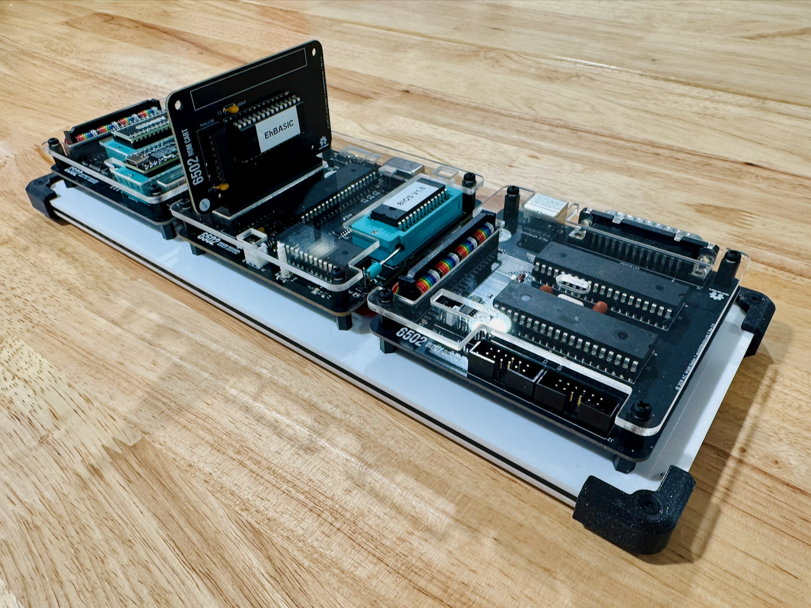

6502-VCS
========

An **AC6502** retro-style 8-bit computer based on the **65C02** microprocessor.

---

## Table of Contents

- [Overview](#overview)
- [Architecture](#architecture)
- [Systems](#systems)
- [Software](#software)
- [Hardware](#hardware)
  - [Main Board](#main-board)
    - [Revision History](#revision-history)
  - [Input Board](#input-board)
  - [Output Board](#output-board)
  - [ROM Cart](#rom-cart)
- [Firmware](#firmware)
  - [IB Controller](#ib-controller)
- [CAD](#cad)
- [Production](#production)
- [Schematics](#schematics)
- [Libraries](#libraries)
- [Bill of Materials](#bill-of-materials)
  - [Main Board](#main-board-1)
  - [Input Board](#input-board-1)
  - [Output Board](#output-board-1)
  - [ROM Cart (Rev 1.0a)](#rom-cart-rev-10a)
  - [ROM Cart (Rev 1.0b)](#rom-cart-rev-10b)
- [License](#license)

---

## Overview

The AC6502 ecosystem is a family of open-source, 65C02-based computers sharing a common architecture, memory map, and [BIOS](https://github.com/acwright/6502-BIOS). Each computer in the family is purpose-built for a different use case but runs the same software and firmware.

The **VCS** is a cartridge-based retro gaming console. It features a real 65C02 CPU, swappable ROM cartridges, VGA video output via [Pico9918](https://github.com/visrealm/pico9918), SID audio via ARMSID, and support for PS/2 keyboards, matrix keyboards, and Atari 2600-compatible joysticks.

## Architecture

All AC6502 computers share:

- **CPU**: 65C02 (or accurate emulation)
- **Memory**: 32KB RAM + 32KB ROM, with optional banked RAM expansion
- **Memory Map**: Standardized across the ecosystem — zero page, stack, I/O space ($8000–$9FFF), system ROM, and interrupt vectors at $FFFA–$FFFF
- **Bus**: 16-bit address bus, 8-bit bidirectional data bus, standard 65C02 control signals (RW, PHI2, RESET, IRQ, NMI, RDY, SYNC)
- **BIOS**: A common [BIOS](https://github.com/acwright/6502-BIOS) provides the kernel, monitor, and BASIC interpreter across all systems

## Systems

| Project | Description |
|---------|-------------|
| [6502-ACE](https://github.com/acwright/6502-ACE) | All-in-one Computer Experience — A single board computer |
| [6502-COB](https://github.com/acwright/6502-COB) | Computer On a Backplane — Modular desktop computer with expandable card slots |
| [6502-DEV](https://github.com/acwright/6502-DEV) | Development Environment Vehicle — Emulation-based dev system |
| [6502-KIM](https://github.com/acwright/6502-KIM) | Keypad Input Monitor - KIM-1 inspired minimal computer |
| [6502-VCS](https://github.com/acwright/6502-VCS) | Video Computer System — Cartridge-based retro gaming console (YOU ARE HERE) |

## Software

| Project | Description |
|---------|-------------|
| [6502-BIOS](https://github.com/acwright/6502-BIOS) | The shared BIOS (kernel, monitor, BASIC) for all AC6502 computers |
| [6502-PRG](https://github.com/acwright/6502-PRG) | Template project for writing assembly language programs |
| [6502-CRT](https://github.com/acwright/6502-CRT) | Template project for writing assembly language cartridges |
| [6502-EMULATOR](https://github.com/acwright/6502-EMULATOR) | Node.js-based AC6502 emulator |
| [6502-WEBULATOR](https://github.com/acwright/6502-WEBULATOR) | Web-based AC6502 emulator |

## Hardware

This repository contains KiCad 7.0+ PCB designs for the three boards that make up the VCS system.

### Main Board
`Hardware/Main Board/`

The core board containing the 65C02 CPU, 32KB SRAM, 32KB EEPROM, clock, and reset circuitry. Runs at 1 MHz and provides the bus connection for the Input and Output boards.

#### Revision History

**Rev 1.1**

- Pull-up resistors changed from 1kΩ to 10kΩ.

**Rev 1.0**

- Initial release.

### Input Board
`Hardware/Input Board/`

Unified input board supporting a matrix keyboard, PS/2 keyboard, and Atari 2600-compatible joysticks. Uses a 65C22 VIA and an ATmega1284p microcontroller as the keyboard encoder controller.

### Output Board
`Hardware/Output Board/`

Combined VGA video output (via Raspberry Pi Pico running [Pico9918](https://github.com/visrealm/pico9918)) and SID audio output (via ARMSID). Provides TMS9918A-compatible graphics modes at 640×480 VGA and 3-voice SID synthesis.

### ROM Cart
`Hardware/ROM Cart/`

Swappable ROM cartridge for the VCS system. Comes in two versions:

- **Rev 1.0a** — Uses the **28C256** 32KB EEPROM (electrically erasable, no UV eraser required).
- **Rev 1.0b** — Uses the **27C256** 32KB EPROM (UV-erasable).

## Firmware

This repository contains [PlatformIO](https://platformio.org/)-based firmware for the Input Board.

### IB Controller
`Firmware/IB Controller/`

Firmware for the ATmega1284p on the Input Board. Provides:

- Matrix keyboard scanning and encoding
- PS/2 keyboard interface
- Atari 2600-compatible joystick input
- Parallel I/O to the AC6502 bus via 65C22 VIA

See [Firmware/IB Controller/README.md](./Firmware/IB%20Controller/README.md) for setup and usage instructions.

## CAD
`CAD/`

3D-printable enclosure parts and laser-cut top panels for the VCS system.

## Production
`Production/`

JLCPCB-ready Gerber files and BOM/CPL for PCB fabrication and assembly.

## Schematics
`Schematics/`

PDF schematics for each board.

## Libraries
`Libraries/`

Shared KiCad symbol and footprint libraries used across all AC6502 hardware projects.

## Bill of Materials

### Main Board

| Reference | Qty | Value | Description | LCSC | DigiKey | Mouser | Other |
|-----------|-----|-------|-------------|------|---------|--------|-------|
| C1, C3–C11 | 10 | 100nF | Unpolarized capacitor | [C49678](https://www.lcsc.com/search?q=C49678) | | | |
| C2 | 1 | 10uF | Polarized capacitor | [C7171](https://www.lcsc.com/search?q=C7171) | | | |
| D1 | 1 | 1N5819 | Schottky Diode SOD-323F | [C191023](https://www.lcsc.com/search?q=C191023) | | | |
| D2 | 1 | LED | LED 0805 | [C2297](https://www.lcsc.com/search?q=C2297) | | | |
| J1 | 1 | PWR_SW | JST XH 1×2 | | [455-2247-ND](https://www.digikey.com/en/products/filter?keywords=455-2247-ND) | | |
| J2 | 1 | ROM WE | Pin Header 1×2 | | | | [AMAZON](https://www.amazon.com/Straight-Breakaway-Connector-Breadboard-Electronic/dp/B0FRZW75VS) |
| J3 | 1 | USB-C | USB 2.0 Type-C Receptacle | [C2988369](https://www.lcsc.com/search?q=C2988369) | | | |
| J4 | 1 | RESET_SW | JST XH 1×2 | | [455-2247-ND](https://www.digikey.com/en/products/filter?keywords=455-2247-ND) | | |
| J5 | 1 | HRDB EN | Pin Header 2×2 | | | | [AMAZON](https://www.amazon.com/Uxcell-Double-Straight-Header-Strip/dp/B00X77A472) |
| J6 | 1 | CLOCK_ENBL_SW | JST XH 1×2 | | [455-2247-ND](https://www.digikey.com/en/products/filter?keywords=455-2247-ND) | | |
| J7 | 1 | 6502 EN | Pin Header 1×2 | | | | [AMAZON](https://www.amazon.com/Straight-Breakaway-Connector-Breadboard-Electronic/dp/B0FRZW75VS) |
| J8 | 1 | EXP EN | Pin Header 2×5 | | | | [AMAZON](https://www.amazon.com/Uxcell-Double-Straight-Header-Strip/dp/B00X77A472) |
| J9 | 1 | 6502 Card Connector | Card Edge 2×20 | | [A31723-ND](https://www.digikey.com/en/products/filter?keywords=A31723-ND) | [571-5-5530843-4](https://www.mouser.com/ProductDetail/571-5-5530843-4) | |
| J10 | 1 | 6502 Bus | Bus Connector 2×20 | | | | [AMAZON](https://www.amazon.com/Female-Headers-Connector-Header-Raspberry/dp/B07DNHS2SJ) |
| Q1 | 1 | SS8050 | NPN Transistor SOT-23 | [C2150](https://www.lcsc.com/search?q=C2150) | | | |
| R1, R4, R9 | 3 | 1k | Resistor | [C17513](https://www.lcsc.com/search?q=C17513) | | | |
| R10–R14 | 5 | 10k | Resistor | [C2930231](https://www.lcsc.com/search?q=C2930231) | | | |
| R2 | 1 | 1M | Resistor | [C17514](https://www.lcsc.com/search?q=C17514) | | | |
| R3 | 1 | 47k | Resistor | [C17713](https://www.lcsc.com/search?q=C17713) | | | |
| R5, R6 | 2 | 5.1k | Resistor | [C27834](https://www.lcsc.com/search?q=C27834) | | | |
| R7 | 1 | 330 | Resistor | [C17630](https://www.lcsc.com/search?q=C17630) | | | |
| R8 | 1 | 10k | Resistor | [C17414](https://www.lcsc.com/search?q=C17414) | | | |
| SW1 | 1 | Reset | Push Button | [C318884](https://www.lcsc.com/search?q=C318884) | | | |
| U1 | 1 | LM555xM | Timer SOIC-8 | [C7593](https://www.lcsc.com/search?q=C7593) | | | |
| U2 | 1 | AS6C62256 | SRAM DIP-28 | | [1450-1033-ND](https://www.digikey.com/en/products/filter?keywords=1450-1033-ND) | [913-AS6C62256-55PCN](https://www.mouser.com/ProductDetail/913-AS6C62256-55PCN) | |
| U3 | 1 | AT28C256 | EEPROM DIP-28 | | [AT28C256-15PU-ND](https://www.digikey.com/en/products/filter?keywords=AT28C256-15PU-ND) | [556-AT28C25615PU](https://www.mouser.com/ProductDetail/556-AT28C25615PU) | |
| U4, U5, U7 | 3 | 74HC00 | Quad NAND SOIC-14 | [C5586](https://www.lcsc.com/search?q=C5586) | | | |
| U6 | 1 | 65C02 | CPU DIP-40 | | | [955-W65C02S6TPG-14](https://www.mouser.com/ProductDetail/955-W65C02S6TPG-14) | |
| X1 | 1 | OCXO-14 | Crystal Oscillator DIP-14 | | [X937-ND](https://www.digikey.com/en/products/filter?keywords=X937-ND) | | |

### Input Board

| Reference | Qty | Value | Description | LCSC | DigiKey | Mouser | Other |
|-----------|-----|-------|-------------|------|---------|--------|-------|
| C1, C3, C5–C8 | 6 | 100nF | Unpolarized capacitor | [C49678](https://www.lcsc.com/search?q=C49678) | | | |
| C2, C4 | 2 | 22pF | Unpolarized capacitor | [C107114](https://www.lcsc.com/search?q=C107114) | | | |
| D1 | 1 | 1N914 | Schottky Diode | | [1N914FS-ND](https://www.digikey.com/en/products/filter?keywords=1N914FS-ND) | | |
| J1 | 1 | PORT B | Box Header 2×6 | | [2057-BHR-12-VUA-ND](https://www.digikey.com/en/products/filter?keywords=2057-BHR-12-VUA-ND) | | [AMAZON](https://www.amazon.com/uxcell-2-54mm-2x6-Pin-Straight-Connector/dp/B07DJYVZV2) |
| J2 | 1 | PORT A | Box Header 2×6 | | [2057-BHR-12-VUA-ND](https://www.digikey.com/en/products/filter?keywords=2057-BHR-12-VUA-ND) | | [AMAZON](https://www.amazon.com/uxcell-2-54mm-2x6-Pin-Straight-Connector/dp/B07DJYVZV2) |
| J3 | 1 | PS/2 KEYBOARD | 6-pin Mini-DIN | | | [806-KMDGX-6S-BS](https://www.mouser.com/ProductDetail/806-KMDGX-6S-BS) | [AMAZON](https://www.amazon.com/dp/B08GS3QL7T) |
| J4 | 1 | 6502 Bus | Bus Connector 2×20 | | | | [AMAZON](https://www.amazon.com/Female-Headers-Connector-Header-Raspberry/dp/B07DNHS2SJ) |
| J5 | 1 | KEYBOARD | DB-25 Connector | | [609-1505-ND](https://www.digikey.com/en/products/filter?keywords=609-1505-ND) | | |
| J6 | 1 | IO SELECT | Pin Header 2×8 | | | | [AMAZON](https://www.amazon.com/Uxcell-Double-Straight-Header-Strip/dp/B00X77A472) |
| R1 | 1 | 1K | Resistor | [C17513](https://www.lcsc.com/search?q=C17513) | | | |
| U1 | 1 | 65C22 | VIA DIP-40 | | | [955-W65C22N6TPG-14](https://www.mouser.com/ProductDetail/955-W65C22N6TPG-14) | |
| U2 | 1 | ATmega1284-P | MCU DIP-40 | | [ATMEGA1284-PU-ND](https://www.digikey.com/en/products/filter?keywords=ATMEGA1284-PU-ND) | [556-ATMEGA1284-PU](https://www.mouser.com/ProductDetail/556-ATMEGA1284-PU) | |
| U3 | 1 | 74HC138 | Decoder SOIC-16 | [C5602](https://www.lcsc.com/search?q=C5602) | | | |
| Y1 | 1 | 16 MHz | Crystal HC49-U | | [3155-16M20P2/49US-ND](https://www.digikey.com/en/products/filter?keywords=3155-16M20P2/49US-ND) | | |

### Output Board

| Reference | Qty | Value | Description | LCSC | DigiKey | Mouser | Other |
|-----------|-----|-------|-------------|------|---------|--------|-------|
| C1 | 1 | 1uF | Capacitor | [C28323](https://www.lcsc.com/search?q=C28323) | | | |
| C2, C3 | 2 | 2.2nF | Capacitor | [C28260](https://www.lcsc.com/search?q=C28260) | | | |
| C5–C10 | 6 | 100nF | Unpolarized capacitor | [C49678](https://www.lcsc.com/search?q=C49678) | | | |
| D1 | 1 | 1N914 | Schottky Diode | | [1N914FS-ND](https://www.digikey.com/en/products/filter?keywords=1N914FS-ND) | | |
| J1 | 1 | VDD | JST XH 1×2 | | [455-2247-ND](https://www.digikey.com/en/products/filter?keywords=455-2247-ND) | | |
| J2 | 1 | AUDIO | RCA Connector | | [PJRAN1X1U02X-ND](https://www.digikey.com/en/products/filter?keywords=PJRAN1X1U02X-ND) | | |
| J6 | 1 | INT Select | Pin Header 1×3 | | | | [AMAZON](https://www.amazon.com/Straight-Breakaway-Connector-Breadboard-Electronic/dp/B0FRZW75VS) |
| J7 | 1 | IO SELECT | Pin Header 2×8 | | | | [AMAZON](https://www.amazon.com/Uxcell-Double-Straight-Header-Strip/dp/B00X77A472) |
| J8 | 1 | 6502 Bus | Bus Connector 2×20 | | | | [AMAZON](https://www.amazon.com/Female-Headers-Connector-Header-Raspberry/dp/B07DNHS2SJ) |
| R1 | 1 | 1k | Resistor | [C17513](https://www.lcsc.com/search?q=C17513) | | | |
| U1 | 1 | Pico9918A | Video Chip DIP-40 | | | | [LINK](https://www.tindie.com/products/visrealm/pico9918-pro/) |
| U2 | 1 | 6581 | SID Chip DIP-28 | | | | [LINK](https://retrocomp.cz/produkt?id=2) |
| U3, U4 | 2 | 74HC138 | Decoder SOIC-16 | [C5602](https://www.lcsc.com/search?q=C5602) | | | |

### ROM Cart (Rev 1.0a)

| Reference | Qty | Value | Description | DigiKey | Mouser | Other |
|-----------|-----|-------|-------------|---------|--------|-------|
| C1, C2 | 2 | 100nF | Capacitor | [478-5732-ND](https://www.digikey.com/en/products/filter?keywords=478-5732-ND) | | [AMAZON](https://www.amazon.com/PANMILED-Multilayer-Monolithic-Capacitors-Assortment/dp/B0CYQ1Z4G5) |
| U1 | 1 | AT28C256 | EEPROM DIP-28 | [AT28C256-15PU-ND](https://www.digikey.com/en/products/filter?keywords=AT28C256-15PU-ND) | [556-AT28C25615PU](https://www.mouser.com/ProductDetail/556-AT28C25615PU) | |
| U2 | 1 | 74HC138 | Decoder DIP-16 | [296-1575-5-ND](https://www.digikey.com/en/products/filter?keywords=296-1575-5-ND) | [595-SN74HC138N](https://www.mouser.com/ProductDetail/595-SN74HC138N) | |

### ROM Cart (Rev 1.0b)

| Reference | Qty | Value | Description | DigiKey | Mouser | Other |
|-----------|-----|-------|-------------|---------|--------|-------|
| C1, C2 | 2 | 100nF | Capacitor | [478-5732-ND](https://www.digikey.com/en/products/filter?keywords=478-5732-ND) | | [AMAZON](https://www.amazon.com/PANMILED-Multilayer-Monolithic-Capacitors-Assortment/dp/B0CYQ1Z4G5) |
| U1 | 1 | AT27C256 | EPROM DIP-28 | [AT27C256R-70PU-ND](https://www.digikey.com/en/products/filter?keywords=AT27C256R-70PU-ND) | | [LINK](https://www.jameco.com/z/AM27C256-255DC-Advanced-Micro-Devices-IC-27C256-25-EPROM-256K-Bit-250ns-CMOS-UV-Electrically-Programmable-ROM_39731.html) |
| U2 | 1 | 74HC138 | Decoder DIP-16 | [296-1575-5-ND](https://www.digikey.com/en/products/filter?keywords=296-1575-5-ND) | [595-SN74HC138N](https://www.mouser.com/ProductDetail/595-SN74HC138N) | |

## License

Hardware designs are released under the [CERN Open Hardware Licence Version 2 – Permissive](https://ohwr.org/cern_ohl_p_v2.txt).  
Firmware is released under the [MIT License](./Firmware/IB%20Controller/LICENSE).
